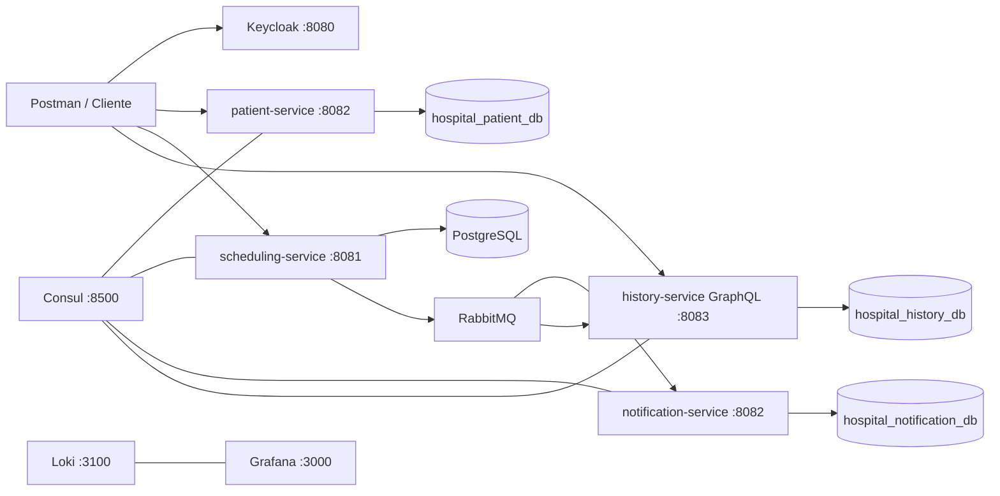

# Tech Challenge Fase 3 - Sistema Hospitalar Modular

Documentacao de entrega para execucao, avaliacao e demonstracao do sistema hospitalar da Fase 3.

Este e o documento unico da entrega. Todas as instrucoes necessarias para compreender, executar e avaliar os microsservicos estao reunidas aqui; os READMEs individuais dos servicos sao apenas materiais tecnicos complementares.

## Sumario

1. [Objetivo](#1-objetivo)
2. [Arquitetura](#2-arquitetura)
3. [Tecnologias e padroes](#3-tecnologias-e-padroes)
4. [Pre-requisitos](#4-pre-requisitos)
5. [Clone dos repositorios](#5-clone-dos-repositorios)
6. [Subir o ambiente completo](#6-subir-a-infraestrutura)
7. [Execucao manual alternativa](#7-iniciar-os-microsservicos-manualmente-alternativa)
8. [Keycloak](#8-keycloak-e-usuarios-de-demonstracao)
9. [Collection Postman](#9-collection-postman)
10. [Endpoints REST](#10-endpoints-rest)
11. [GraphQL](#11-graphql-e-historico)
12. [RabbitMQ](#12-rabbitmq-e-comunicacao-assincrona)
13. [Observabilidade](#13-observabilidade)
14. [Troubleshooting](#14-troubleshooting)
15. [Repositorio e avaliacao](#15-repositorio-e-avaliacao)
16. [Checklist de entrega](#16-checklist-de-entrega)

## 1. Objetivo

O projeto implementa uma arquitetura distribuida para cadastro de pacientes, agendamento de consultas, processamento assincrono de eventos e consulta do historico de agendamentos.

A entrega e composta por uma organizacao com os seguintes repositorios:

- `hospital-parent`: parent Maven com versoes e configuracoes compartilhadas.
- `hospital-infrastructure`: Docker Compose, Keycloak, banco inicial, observabilidade e esta documentacao.
- `hospital-patient-service`: cadastro de pacientes e provisionamento de identidade no Keycloak.
- `hospital-scheduling-service`: comandos REST de agendamento, autorizacao e publicacao de eventos.
- `hospital-notification-service`: consumidor RabbitMQ para processamento idempotente de eventos.
- `hospital-history-service`: projecao do historico e consultas GraphQL.

O objetivo deste documento e permitir que a banca clone os repositorios da organizacao, suba a infraestrutura e valide o funcionamento do ecossistema sem depender do ambiente de desenvolvimento original.

## 2. Arquitetura



### Responsabilidades

| Componente | Responsabilidade | Porta |
|---|---|---:|
| Keycloak | OAuth2, JWT, usuarios e roles | 8080 |
| patient-service | Cadastro de paciente e integracao com Keycloak | 8084 (interno: 8082) |
| scheduling-service | Criacao, consulta e atualizacao de agendamentos | 8081 |
| notification-service | Consumo de eventos e idempotencia | 8082 |
| history-service | Historico de agendamentos via GraphQL | 8083 |
| PostgreSQL | Bancos isolados por microsservico | 5432 |
| RabbitMQ | Comunicacao assincrona | 5672 / 15672 |
| Consul | Service discovery e health checks | 8500 |
| Grafana | Visualizacao de logs | 3000 |
| Loki | Agregacao de logs | 3100 |

O `patient-service` e o `notification-service` usam a porta `8082` em momentos diferentes no ambiente atual? Para a demonstracao integrada, o `patient-service` deve ser executado em outra porta, por exemplo `8084`, pois o `notification-service` usa `8082`. Consulte a secao de execucao para iniciar o patient-service com `SERVER_PORT=8084`.

## 3. Tecnologias e padroes

- Java 25.
- Spring Boot 4.1.1.
- Maven Wrapper em cada microsservico.
- Clean Architecture e separacao entre dominio, aplicacao, infraestrutura e apresentacao.
- PostgreSQL com Flyway.
- Keycloak com JWT e roles `PATIENT`, `DOCTOR` e `NURSE`.
- RabbitMQ com exchange `hospital.appointments`.
- GraphQL para leitura do historico.
- Consul para descoberta de servicos.
- Grafana e Loki para observabilidade.

## 4. Pre-requisitos

Instale na maquina da banca:

- Git.
- Docker e Docker Compose.
- Java 25.
- Acesso ao repositorio da organizacao.
- Postman, Insomnia ou cliente HTTP equivalente.

Nao e necessario instalar Maven globalmente. Os projetos possuem `mvnw` proprio.

## 5. Clone dos repositorios

Clone todos os repositorios no mesmo diretorio pai. O `relativePath` do `pom.xml` depende dessa estrutura:

```bash
mkdir -p ~/hospital-fase3
cd ~/hospital-fase3

git clone https://github.com/tech-challenge-fase3/hospital-parent.git
git clone https://github.com/tech-challenge-fase3/hospital-infrastructure.git
git clone https://github.com/tech-challenge-fase3/hospital-patient-service.git
git clone https://github.com/tech-challenge-fase3/hospital-scheduling-service.git
git clone https://github.com/tech-challenge-fase3/hospital-notification-service.git
git clone https://github.com/tech-challenge-fase3/hospital-history-service.git
```

## 6. Subir a infraestrutura

Entre no repositorio de infraestrutura:

```bash
cd hospital-infrastructure
docker compose up --build -d
```

Esse comando constroi as quatro imagens dos microsservicos e cria:

- PostgreSQL;
- bancos `hospital_db`, `hospital_patient_db`, `hospital_notification_db`, `hospital_history_db` e `keycloak_db`;
- Keycloak com importacao automatica do realm;
- RabbitMQ com painel de administracao;
- Consul;
- Loki e Grafana.

A ordem e controlada pelo Compose: PostgreSQL, RabbitMQ e Consul passam pelos healthchecks antes dos microsservicos serem iniciados. Os servicos Java possuem `restart: on-failure` para tolerar o tempo de bootstrap do Keycloak.

Para acompanhar a subida:

```bash
docker compose logs -f scheduling-service notification-service history-service patient-service
```

Para parar o ambiente:

```bash
docker compose down
```

Verifique os containers:

```bash
docker compose ps
```

Aguarde o Keycloak terminar o bootstrap antes de solicitar tokens. O realm importado e `hospital`.

### Ambiente ja inicializado

O script `init-databases.sql` so e executado automaticamente quando o volume do PostgreSQL e criado pela primeira vez. Se uma instalacao anterior nao possuir algum banco, crie-o manualmente:

```bash
docker exec hospital-postgres psql -U admin -d postgres -c "CREATE DATABASE hospital_notification_db"
docker exec hospital-postgres psql -U admin -d postgres -c "CREATE DATABASE hospital_history_db"
```

Para uma reinstalacao completamente limpa, somente quando autorizado:

```bash
docker compose down -v
docker compose up --build -d
```

## 7. Iniciar os microsservicos manualmente (alternativa)

O fluxo oficial e o comando unico da secao anterior. A execucao manual abaixo existe apenas para desenvolvimento e diagnostico.

### Scheduling

```bash
cd hospital-scheduling-service
./mvnw spring-boot:run
```

URL base: `http://localhost:8081/scheduling-service`

### Notification

```bash
cd hospital-notification-service
./mvnw spring-boot:run
```

Health: `http://localhost:8082/actuator/health`

### History GraphQL

```bash
cd hospital-history-service
./mvnw spring-boot:run
```

Health: `http://localhost:8083/actuator/health`

GraphQL: `http://localhost:8083/graphql`

### Patient

Como o notification-service usa a porta `8082`, a imagem do patient-service e publicada no host em `8084`:

```bash
cd hospital-patient-service
SERVER_PORT=8084 ./mvnw spring-boot:run
```

URL base: `http://localhost:8084/patient-service`

Se o servico for executado na porta padrao `8082`, ele entrara em conflito com o notification-service. Nesse caso, use `SERVER_PORT=8084` tambem na collection.

### Configuracao do Keycloak para outra maquina

Os defaults foram alinhados para `localhost`. Se a banca executar os servicos em outro host, use variaveis de ambiente:

```bash
KEYCLOAK_ISSUER_URI=http://<HOST>:8080/realms/hospital ./mvnw spring-boot:run
KEYCLOAK_SERVER_URL=http://<HOST>:8080 SERVER_PORT=8084 ./mvnw spring-boot:run
```

## 8. Keycloak e usuarios de demonstracao

Realm: `hospital`

Console administrativo: `http://localhost:8080`

Credenciais do console:

```text
usuario: admin
senha: admin
```

Usuarios importados:

| Usuario | Senha | Role | Uso |
|---|---|---|---|
| `patient.test` | `Hospital@123` | `PATIENT` | Consultar os proprios agendamentos |
| `doctor.test` | `Hospital@123` | `DOCTOR` | Criar, consultar e atualizar agendamentos |
| `nurse.test` | `Hospital@123` | `NURSE` | Criar, consultar e atualizar agendamentos |

O usuario paciente possui o atributo `patientId`:

```text
123e4567-e89b-12d3-a456-426614174000
```

Esse atributo e transformado em claim `patientId` no access token pelo Protocol Mapper do realm.

## 9. Collection Postman

Arquivo entregue:

```text
Tech-Challenge - Fase-3.postman_collection0709
```

Importe esse arquivo no Postman. As variaveis principais sao:

| Variavel | Valor inicial |
|---|---|
| `baseUrl` | `http://localhost` |
| `keycloakUrl` | `http://localhost:8080` |
| `realm` | `hospital` |
| `patientServicePort` | `8084`, se configurada no ambiente |
| `patientToken` | preenchida automaticamente |
| `doctorToken` | preenchida automaticamente |
| `nurseToken` | preenchida automaticamente |
| `appointmentId` | preenchida automaticamente apos o POST |

### Gerar tokens

Execute na pasta `hospital-patient-service` da collection:

1. `getPatientToken`;
2. `getDoctorToken`;
3. `getNurseToken`.

Cada request possui um script de teste que:

- valida HTTP `200`;
- le `access_token` da resposta do Keycloak;
- salva o valor em uma variavel da collection;
- calcula e salva o vencimento em `patientTokenExpiresAt`, `doctorTokenExpiresAt` ou `nurseTokenExpiresAt`;
- informa no console qual token foi atualizado.

Nao copie tokens manualmente para os requests protegidos. Eles usam automaticamente:

```text
{{patientToken}}
{{doctorToken}}
{{nurseToken}}
```

O procedimento da banca e apenas executar os tres requests de token. O JavaScript da aba **Tests** de cada request faz a captura e a persistencia das variaveis; os requests de agendamento ja referenciam essas variaveis no campo Bearer Token.

### Ordem recomendada de demonstracao

1. `getPatientToken`.
2. `getDoctorToken`.
3. `getNurseToken`.
4. `createAppointment` com `doctorToken`.
5. `getAllAppointments` com `patientToken`.
6. `getAppointmentById` com `patientToken`.
7. `updateAppointment` com `doctorToken`.
8. `patientHistory` no grupo `hospital-history-service`.

O request de criacao salva automaticamente o ID retornado em `appointmentId`.

### Regras de autorizacao demonstraveis

- Paciente pode consultar seus agendamentos.
- Paciente nao pode criar agendamento: retorna `403` com mensagem explicativa.
- Medico e enfermeiro podem criar e atualizar agendamentos.
- Paciente tentando consultar agendamento de outro paciente recebe `404`, sem revelar dados de terceiros.
- Token ausente, invalido ou expirado retorna `401` em JSON.

## 10. Endpoints REST

### Patient Service

```http
POST http://localhost:8084/patient-service/api/v1/patients
Content-Type: application/json
```

Exemplo:

```json
{
  "name": "Carlos Alberto",
  "cpf": "12345678901",
  "email": "carlos.alberto@email.com",
  "password": "Carlos@123",
  "birthDate": "1985-10-20"
}
```

Swagger, quando habilitado no servico:

```text
http://localhost:8084/patient-service/swagger-ui.html
```

### Scheduling Service

```text
POST /scheduling-service/api/v1/appointments
GET  /scheduling-service/api/v1/appointments
GET  /scheduling-service/api/v1/appointments/{id}
PUT  /scheduling-service/api/v1/appointments/{id}
```

Criacao:

```json
{
  "patientId": "123e4567-e89b-12d3-a456-426614174000",
  "doctorId": "987fcdeb-512a-43f7-b234-987654321000",
  "appointmentDate": "2026-12-15T14:30:00",
  "notes": "Consulta de rotina"
}
```

Respostas importantes:

- `201 Created`: agendamento criado.
- `400 Bad Request`: dados invalidos.
- `401 Unauthorized`: token ausente, invalido ou expirado.
- `403 Forbidden`: role sem permissao.
- `404 Not Found`: agendamento inexistente ou indisponivel para o paciente.
- `409 Conflict`: conflito de horario ou integridade.

## 11. GraphQL e historico

Endpoint:

```text
POST http://localhost:8083/graphql
```

Exemplo para o paciente:

```json
{
  "query": "query PatientHistory($patientId: ID!) { patientHistory(patientId: $patientId) { appointmentId patientId doctorId appointmentDate status notes createdAt updatedAt } }",
  "variables": {
    "patientId": "123e4567-e89b-12d3-a456-426614174000"
  }
}
```

Consultas disponibilizadas:

- `patientHistory(patientId)`;
- `appointmentsByPatient(patientId)`;
- `appointmentsByDoctor(doctorId)`.

O history-service recebe os eventos por filas proprias e cria uma projecao local. Ele nao acessa diretamente o banco do scheduling-service.

## 12. RabbitMQ e comunicacao assincrona

Exchange:

```text
hospital.appointments
```

Eventos:

```text
appointment.created
appointment.updated
```

Filas do notification-service:

```text
hospital.appointments.created
hospital.appointments.updated
```

Filas do history-service:

```text
hospital.history.appointments.created
hospital.history.appointments.updated
```

O scheduling-service publica o evento somente depois de persistir o agendamento. Os eventos carregam `eventId`, `eventType`, `appointmentId` e os dados do agendamento.

O notification-service usa ACK manual, idempotencia por `eventId`, retry para falhas transitorias e controle de eventos antigos por `updatedAt`. O history-service usa filas separadas para manter sua propria projecao de leitura.

Painel RabbitMQ:

```text
http://localhost:15672
usuario: guest
senha: guest
```

## 13. Observabilidade

Consul:

```text
http://localhost:8500
```

Grafana:

```text
http://localhost:3000
usuario: admin
senha: admin
```

Loki:

```text
http://localhost:3100
```

Os servicos registram seus nomes no Consul:

- `hospital-patient-service`;
- `scheduling-service`;
- `notification-service`;
- `history-service`.

## 14. Troubleshooting

### Porta ocupada

```bash
lsof -i :8081
lsof -i :8082
lsof -i :8083
```

Finalize somente o processo identificado:

```bash
kill <PID>
```

### Maven nao encontrado no PATH

Use o wrapper do proprio projeto:

```bash
./mvnw -DskipTests clean compile
```

### Keycloak ainda nao responde

Confira os logs:

```bash
docker logs -f hospital-keycloak
```

Aguarde o realm ser importado e tente novamente o request de token.

### Banco ausente

Confira os bancos:

```bash
docker exec hospital-postgres psql -U admin -d postgres -c "\\l"
```

Crie o banco faltante e reinicie o servico para o Flyway aplicar as migrations.

### RabbitMQ sem mensagens

Confira o painel em `http://localhost:15672` e valide se o scheduling publicou o evento depois de um `201 Created`.

## 15. Repositorio e avaliacao

O repositorio da organizacao deve conter os seis repositorios listados na secao 1. A banca pode revisar:

- separacao de responsabilidades entre microsservicos;
- uso de Keycloak e roles;
- isolamento de bancos;
- persistencia versionada por Flyway;
- comunicacao assincrona por RabbitMQ;
- idempotencia e ACK manual;
- consulta GraphQL do historico;
- collection Postman com tokens automatizados;
- documentacao de execucao;
- observabilidade por Consul, Grafana e Loki.

## 16. Checklist de entrega

- [ ] Todos os repositorios da organizacao estao acessiveis para a banca.
- [ ] O arquivo `docker-compose.yml` esta no repositorio de infraestrutura.
- [ ] O realm `realm-hospital.json` esta versionado.
- [ ] A collection Postman esta versionada.
- [ ] Os scripts de token salvam automaticamente as variaveis.
- [ ] O README da infraestrutura esta versionado.
- [ ] Os cinco bancos sao criados em instalacao limpa.
- [ ] `docker compose up --build -d` constroi e inicia os quatro microsservicos.
- [ ] Os servicos tambem podem ser compilados individualmente com Maven Wrapper.
- [ ] A banca consegue reproduzir o fluxo REST, RabbitMQ e GraphQL.
